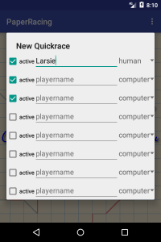
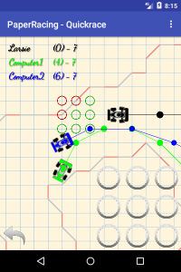
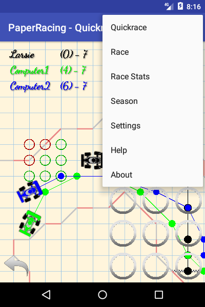
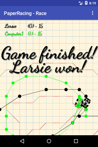
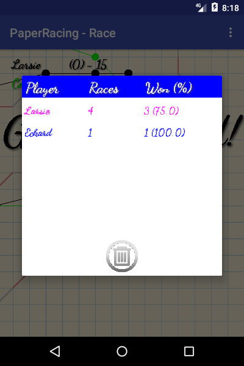
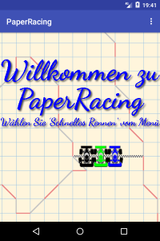
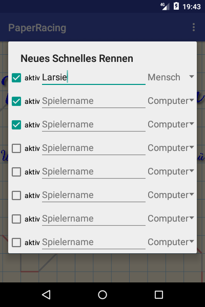
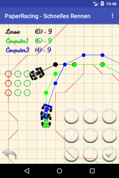
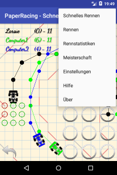
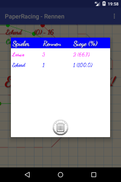

<h1>PaperRacing</h1>
Deutsch weiter unten! 

&nbsp; 
&nbsp; 
&nbsp; 

Play racetrack paper and pencil game on your Android device. 
You can build it with AndroidStudio or find the APK in the app folder. 
 
 
<h1>PaperRacing</h1>

&nbsp; 
&nbsp; 
&nbsp; 

Spielen Sie das Papier- und Bleistiftspiel RaceTrack auf Ihrem Android-Gerät. 
Sie k&ouml;nnen es mit AndroidStudio &uuml;bersetzen, oder aber die APK im app-Ordner finden. 

